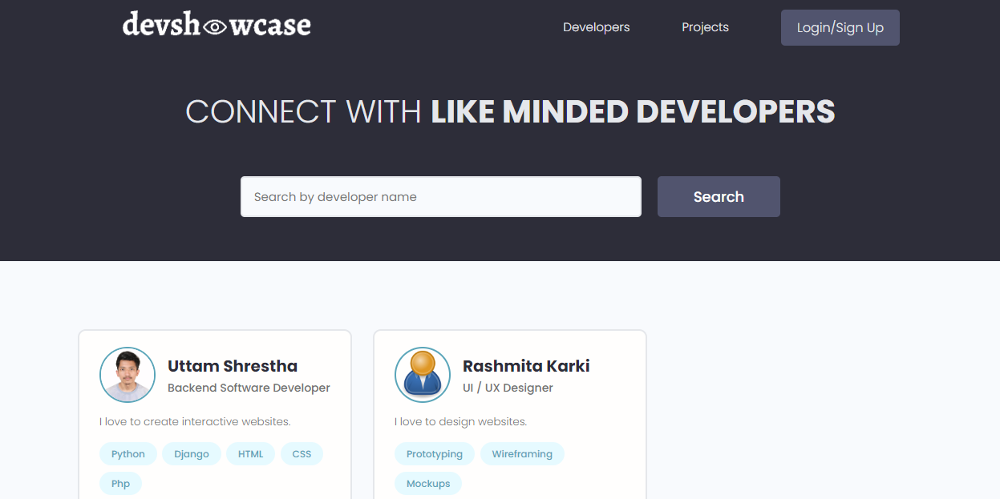
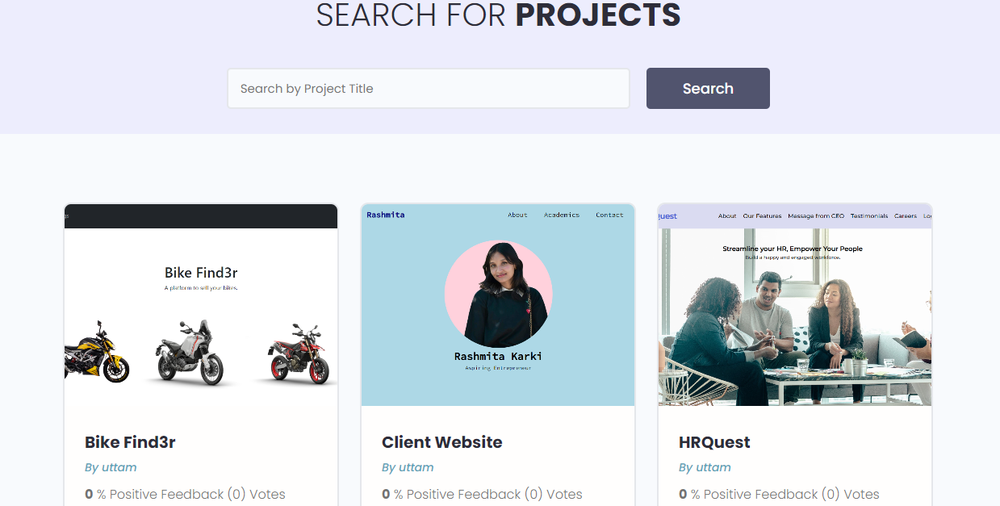
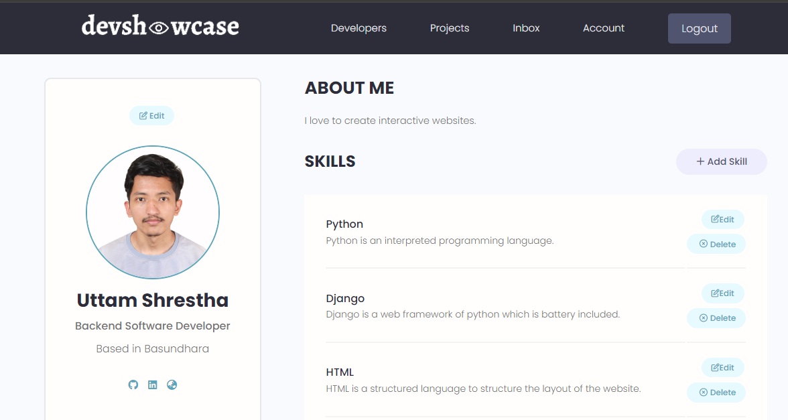

# Devshowcase

Devshowcase is a Django-based application that allows developers to showcase their skill sets and projects on the site. Developers can connect, display their work, explore the talents of others, send messages through the integrated inbox feature and search for specific skills and projects.

## Prerequisites

- Text Editor (VS Code)
- Git
- Python 3.10 or above
- Django 4.2

## Built with

- Python
- HTML
- CSS
- JS

## Installation

1. Clone the repository to your local machine.

```
git@github.com:uttamshr10/devshowcase.git
```

2. Navigate to `cd devshowcase`

3. Create virtual environment.

```
virtualenv env
```

4. Activate the environment.

```
env/Scripts/activate
```

5. Install the required dependencies.

```
pip install -r requirements.txt
```

6. Start the development server.

```
python manage.py runserver
```

7. Open your web browser and visit `http://127.0.0.1:8000/` to access the devshowcase application.

<p align="center"><b>Home Page / Developers</b></p>



<p align="center"><b>Projects</b></p>



<p align="center"><b>Account</b></p>



[Live Demo](https://devshowcase-25da3d4c34f9.herokuapp.com/)

# Author

## Uttam Shrestha

[](https://www.linkedin.com/in/uttamshr/)

[](https://github.com/uttamshr10)

# Contributing

Contributions are welcome! If you find any bugs or have any suggestions for improvements, please create an issue or a pull request.

# Contact

If you have any questions or feedback, feel free to contact me at utam.shrestha65@gmail.com
